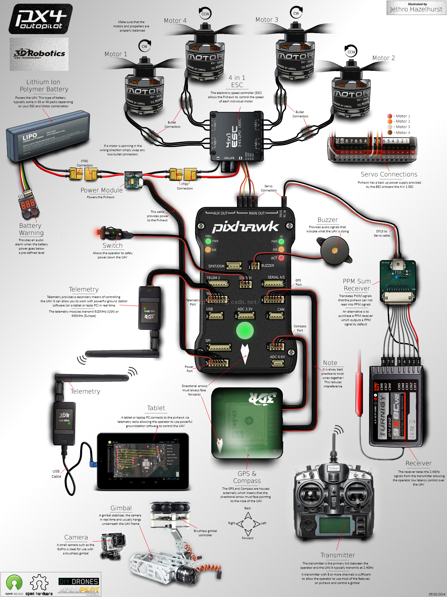
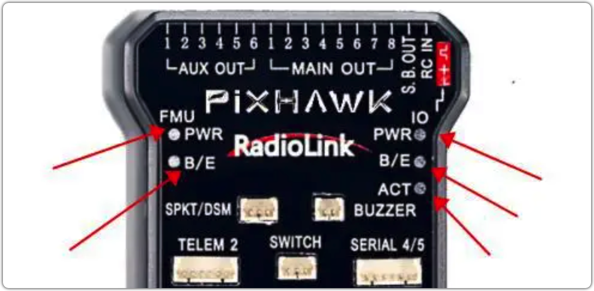

# Copter Notes

*作者: GrooveWJH*

## 组成

| 元件       | 型号                         | 数量 |
| ---------- | ---------------------------- | ---- |
| 飞控       | Pix4 2.4.8                   |      |
| 电机       | 2212 960KV                   |      |
| 电调ESC    | 好盈乐天HobbyWing XRotor 20A | 4    |
| 机架       | F450                         |      |
| 电池       | 5200mah                      |      |
| 地面站软件 | QGroundControl               |      |
|            |                              |      |

## 飞控Pix4 2.4.8 基本接线

## 状态指示灯

### 1. 飞控RGB LED指示灯含义

在静态文件中查看时上图gif不可参考

 + 红灯和蓝灯闪： 初始化中。 请稍等。
+ 黄灯双闪： 错误。 系统拒绝解锁。
+ 蓝灯闪： 已加锁，GPS搜星中。自动导航，悬停，还有返回出发点模式需要GPS锁定。
+ 绿灯闪： 已加锁，GPS锁定已获得。 准备解锁。 从加锁状态解锁时，会有快速的两次响声提示。
+ 绿灯长亮加单次长响：GPS锁定并且解锁。 准备起飞
+ 黄灯闪：遥控故障保护被激活。
+ 黄灯闪加快速重复响：电池故障保护被激活。
+ 黄灯蓝灯闪加高-高-高-低响： GPS数据异常或者GPS故障保护被激活。

### 2. FMU与I/O指示灯

- FMU PWR = Flight management Unit Power：FMU 飞控板电源指示灯=飞行管理电源单元（飞控板供电正常时此灯常亮）
- FMU B/E = FMU Processor in Bootloader mode (flashing) or Error (Steady)：FMU 飞控板 B/E 灯=FMU 处理器的 bootloader 模式（闪烁）或错误（稳定）
- I/O PWR = Input/ Output Power：I/O 输入输出电源指示灯=输入/输出电源（电调供电正常时此灯常亮）
- I/O B/E = I/O processor in Bootloader mode (flashing) or Error (Steady)：输入输出 B/E 指示灯=输入输出处理器 Bootloader 模式指示灯，正常时闪烁，错误时稳定常亮
- ACT = Activity (a flashing heartbeat) indicating everything is ok：ACT=活动（闪烁跳动）表明一切正常（此处的活动意思是当我们解锁成功时或者数传连接成功等）

### 3. 安全开关Safety Switch含义

+ 快速，持续闪烁：执行系统自检中。 请稍等。
+ 间歇闪烁： 系统就绪。 请按安全开关按钮以激活系统。
+ 常亮：已经准备好解锁。 可以执行解锁程序。
### 4. 蜂鸣器指示灯含义

- 1 初始化 红蓝色闪光
- 2 未解锁时，GPS未锁定，蓝色闪光，一长声解锁音
- 3 未解锁时，GPS锁定，绿色LED闪亮，两短音
- 4 解锁时，GPS锁定，绿色LED常亮，一长音
- 5 解锁失败，两低音
- 6 ESC校准，红绿蓝LED闪光
- 7 无线电故障，黄色LED闪亮
- 8 电池故障，黄色LED闪亮，急促短音
- 9 GPS故障，黄色和蓝色LED闪亮
- 10 EKF惯导失败，黄色和红色LED闪亮
- 11 气压计故障，黄色和紫色LED闪亮
- 11 气压计故障，黄色和紫色LED闪亮
- 12 未插内存卡，红色LED

## 缩写及常见名词汇总

| 名词 | 释义                                             | 功能                                                   |
| :--- | :----------------------------------------------- | ------------------------------------------------------ |
| PID  | 比例(proportion)-积分(integral)-微分(derivative) | 对应一种算法或控制器，用于动态系统响应反馈的快稳准实现 |
| PWM  | Pulse width modulation 脉冲宽度调制              | 以数字手段控制模拟电路                                 |
| RC   | Remote control 遥控、远程控制                    |                                                        |
| ESC  | Electronic Speed Control 电子调速器、电调        | 给电机供电调节其转速                                   |
| OSD  | On Screen Display 视频叠加系统                   | 将许多数据整合叠加在一个屏幕上，如图像、电压等         |
| 图传 | 实时摄像图像传输                                 | *顾名思义*                                             |
| 数传 | 无线数据传输                                     | 可以实现无线调参，调参更方便                           |
|      |                                                  |                                                        |
|      |                                                  |                                                        |

## 教程&指南

- [电调校准]([电调（ESC）校准 | PX4 自动驾驶用户指南](https://docs.px4.io/main/zh/advanced_config/esc_calibration.html))

- 

## 遇到的问题&解决方法

| 问题 |  可能原因&方法    |
| ---- | ---- |
|电机间歇性哔哔响|接收机油门通道无油门信号输出，油门控制通道连线不正常|
|电调校准现有三种方法|1. MP\ 2.QG自动\ 3.不接飞控，电调单独与接收器连接|
|（？）在电调校准以后依然有电机延迟停转| ？     |
|正常开机时电机发出长鸣音，表示电调准备就绪    |      |
|      |      |
|      |      |
|      |      |

## 主要参数

|      |      |      |
| ---- | ---- | ---- |
|      |      |      |
|      |      |      |
|      |      |      |
|      |      |      |
|      |      |      |
|      |      |      |
|      |      |      |

